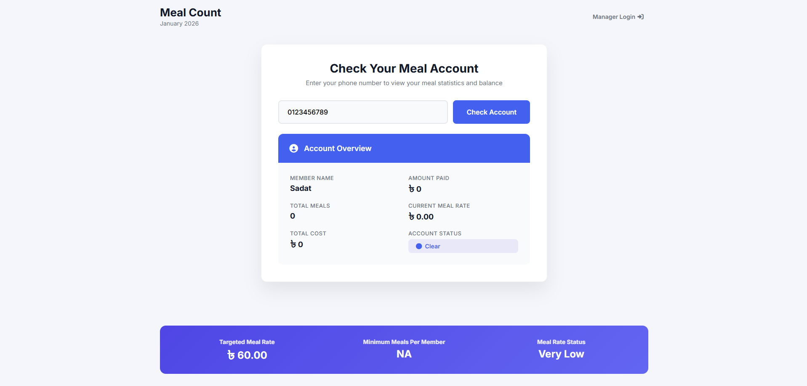
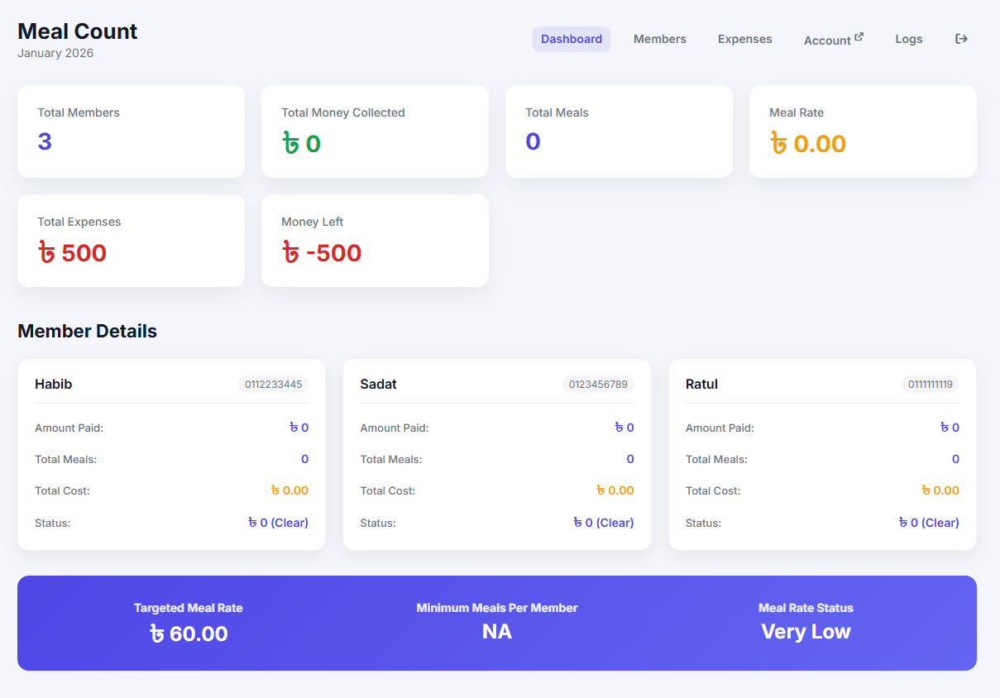
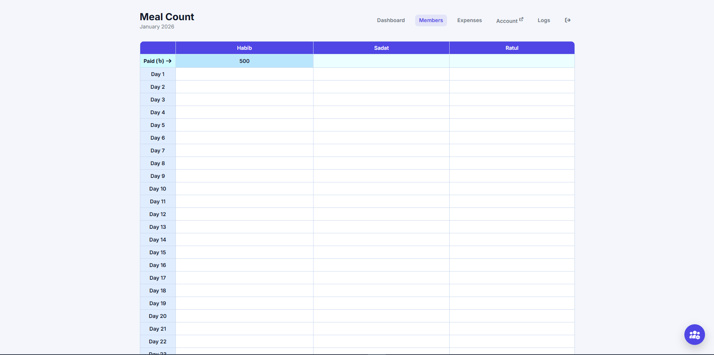
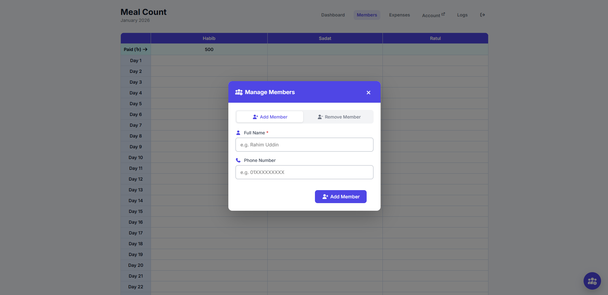
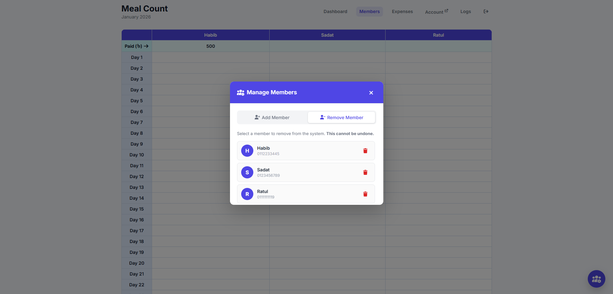
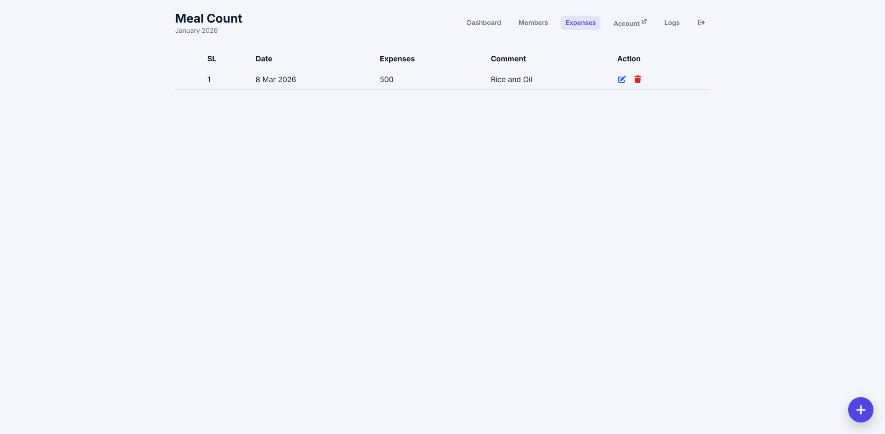
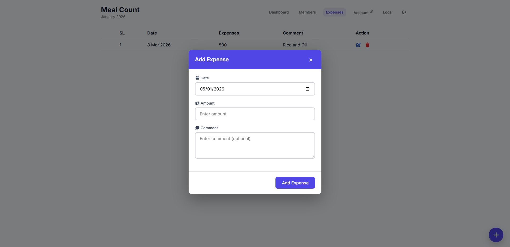
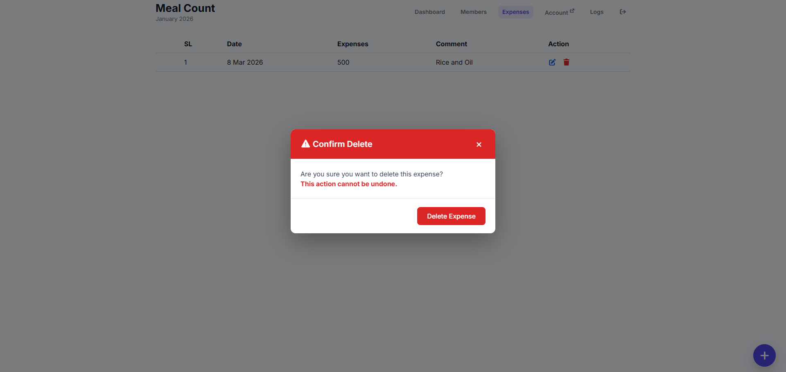

# 🍽️ Meal Management System

A **full-stack web application** designed to manage shared meal systems (mess/hostel) by automating meal tracking, expense management, and cost distribution among members.

---

## 🚀 Features

### 👤 Member Panel
- Check account using phone number
- View:
  - Member Name  
  - Amount Paid  
  - Total Meals Consumed  
  - Current Meal Rate  
  - Total Cost  
  - Account Status (**Clear / Due / Refund**)  

---

### 🔐 Manager Panel (Secure Access)
- Login using **secret key authentication**
- Full control over system data

---

### 📊 Dashboard Overview
**Auto calculated everything**
- Total Members  
- Total Money Collected  
- Total Meals  
- Meal Rate  
- Total Expenses  
- Remaining Balance  

---

### 👥 Member Management
- Add / Remove members dynamically  
- Track:
  - Individual payments
  - Meals per member daily
- Excel-like **daily meal entry system**

---

### 💸 Expense Management
- Add, edit, delete expenses  
- Track expense history with date & comments  
- Automatically affects **meal rate calculation**

---

### 📈 Smart Calculation System
- **Meal Rate = Total Expenses ÷ Total Meals**

Automatically updates:
- Each member’s total cost  
- Account status (**Clear / Due / Refund**)  

---

### 🧾 User Activity Logs
- Track:
  - Member account checks  
  - Manager login activity  

Includes:
- Device info  
- Location  
- IP address  
- Date & time  

---

## 🧠 System Workflow

1. Manager adds members  
2. Manager inputs:
   - Daily meals  
   - Expenses  
   - Payments  

3. System automatically:
   - Calculates meal rate  
   - Updates individual costs  
   - Determines account status  

4. Members can check their account anytime via phone number  

---

## 🛠️ Tech Stack

### Frontend
- HTML  
- CSS  
- JavaScript
- Responsive UI Design  

### Backend
- PHP

### Database
- MySQL  

### Other
- Session-based authentication  
- REST-like routing  
- Real-time calculation logic  

---

## 📸 Screenshots

### 📱 Member Account View


### 📊 Dashboard


### 👥 Member Management




### 💸 Expense Panel




### 🔐 Login Page


---

## 🔐 Security Features

- Secret key-based manager authentication  
- Activity logging for monitoring access  
- Controlled data manipulation (**CRUD restrictions**)  
- Brute-force protection system:
  - Maximum **5 failed login attempts**
  - Temporary access block after limit exceeded  
- Session-based access control for secure dashboard usage  

---

## ⚙️ Installation (Local Setup)

```bash
git clone https://github.com/habib-rnhm/meal-management-system.git
cd meal-management-system
```
### Setup Steps
- Import database file into MySQL
- Configure database connection
- Run on local server (XAMPP / Laragon)
- Open: ```http://localhost/```
- Default Secret Key: ```manager123```

## 💡 Use Case
**This system is ideal for:**
- Student hostels
- Shared apartments
- Mess management systems
